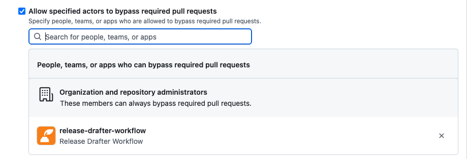
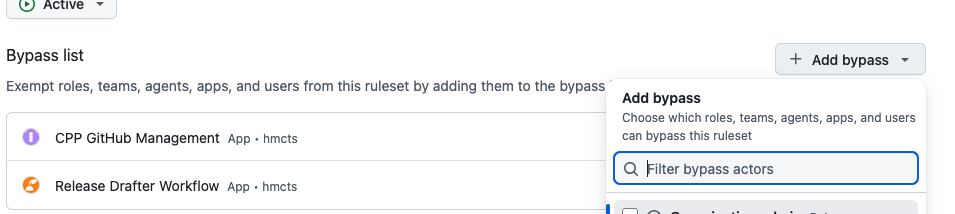
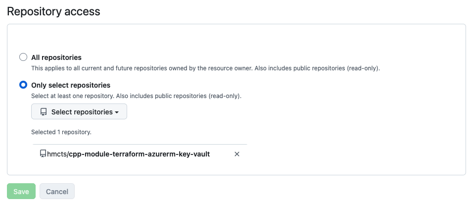
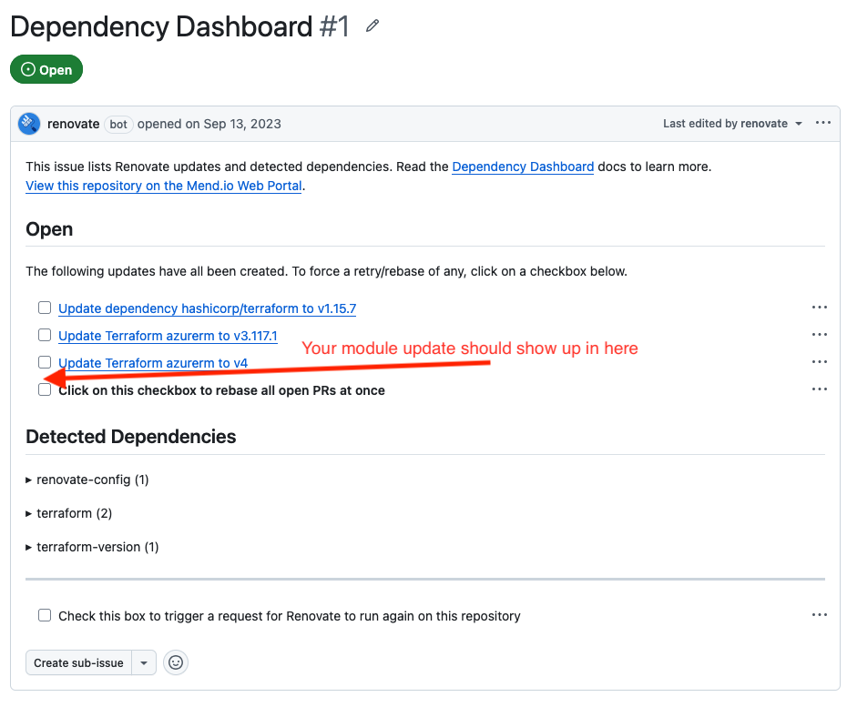
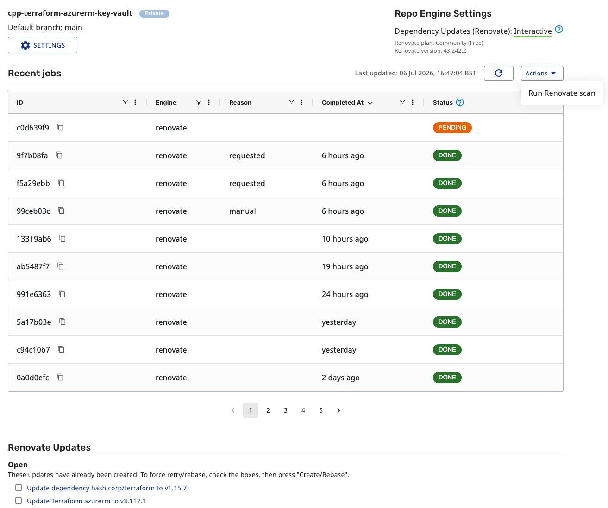

# Adding Renovate presets for Terraform modules

If you would like to add global presets for more Terraform modules so that they can be automatically kept up to date by Renovate across consuming repositories you can use [cpp-terraform-azurerm-key-vault.json](./renovate/cpp-terraform-azurerm-key-vault.json) as an example.
Steps described below can probably be also adapted to work with any other custom dependencies, not just Terraform modules.

## 1. Ensure your Terraform module is versioned

In your Terraform module add following workflows:

- [Release Drafter GitHub Action Workflow](https://github.com/hmcts/cnp-githubactions-library/blob/main/.github/workflows/release-drafter.md)
- [Label Check GitHub Action Workflow](https://github.com/hmcts/cnp-githubactions-library/blob/main/.github/workflows/label-check.md)
- [Update Changelog GitHub Action Workflow](https://github.com/hmcts/cnp-githubactions-library/blob/main/.github/workflows/update-changelog.md)

Follow the instructions in the above readme files on how to implement these in your repository - `Update Changelog` action should already be included as one of the jobs in the template provided for the `Release Drafter` action.  
Ensure you have a initial release tag available such as `v1.0.0` so that the `Release Drafter` workflow has something to start from.

Once you have the workflows running in your repository, you should have following:

- Starting point release tag created manually such as `v1.0.0`, it should also be listed under `Releases` in your GitHub repository.
- Label Check action should be validating your every PR to ensure it has either an appropriate label or a suitable title to figure out the extent of the change (`patch/minor/major`)
- Release Drafter action should be running after you merge your PR and drafting the next release version based on the title as described in the [Release Drafter Readme](https://github.com/hmcts/cnp-githubactions-library/blob/main/.github/workflows/release-drafter.md) or on `breaking-change` label for `major` changes that you manually assign on your PR.
- Update Changelog action should be automatically pushing an update to the changelog file in the repository after the PR is merged and the release is drafted.

## 2. Exclude Changelog Action GitHub App from branch protection

If your repository has either a branch protection rule or a Ruleset configured that requires `PR reviews` or `CI checks` to pass before merging to the main branch you will need to ensure `Update Changelog` action authenticates with a GitHub App excluded from these checks: 

Ensure that you have copied the correct action configuration, the `update-changelog` action should be in a `job` block along with GitHub App authentication steps:
```
...
jobs:
  ...
  changelog:
    needs: draft
    if: needs.draft.outputs.version != ''
    runs-on: ubuntu-latest
    permissions:
      contents: write
    steps:
      - name: Generate GitHub App token
        uses: actions/create-github-app-token@v1
        id: app-token
        with:
          app-id: ${{ secrets.RELEASE_DRAFTER_APP_ID }}
          private-key: ${{ secrets.RELEASE_DRAFTER_PRIVATE_KEY }}

      - uses: actions/checkout@v4
        with:
          fetch-depth: 0
          token: ${{ steps.app-token.outputs.token }}

      - uses: hmcts/cnp-githubactions-library/update-changelog@main
        with:
          github-token: ${{ steps.app-token.outputs.token }}
          version: ${{ needs.draft.outputs.version }}
          tag:     ${{ needs.draft.outputs.tag }}
```

### If you have branch protection enabled, go to:
- `Your repository` > `Settings` > `Branches` > `Branch Protection Rule` > `<Rule-Name>`
- Then click on `Allow specified actors to bypass required pull requests `
- Enter `release-drafter-workflow` in the search bar and add it to the exclusion list as show below



### If you have a Ruleset go to:
- `Your repository` > `Settings` > `Rulest` > `Rulesets` > `<Ruleset-name>`
- Then under section `Bypass list` click on `Add bypass` dropdown and search for `Release Drafter Workflow` and click to add as shown below



## 3. Allow Release Drafter Workflow GitHub App write access to your repository

> **_NOTE:_**  This needs to be done by the admin of the HMCTS organisation on GitHub, reach out to Platform Operations team regarding this.

- On GitHub go to `HMCTS` organisation > `Settings` > `Developer Settings` > `GitHub Apps` > then find `Release Drafter Workflow` app
- Click on `Install App` then click `settings cog icon` under `HMCTS`
- Under `Repository access` there will be `Only select repositories` option selected, click on this then search for your repository to add it
- Finally click save



Changelog action should now be able to push changelog file updates directly to your main branch without needing to raise a PR or pass PR checks.

## 4. Add new Renovate preset for the Terraform module

åAdd new Terraform module preset to this repository, use  [cpp-terraform-azurerm-key-vault.json](./renovate/cpp-terraform-azurerm-key-vault.json) as an example:
```
{
  "$schema": "https://docs.renovatebot.com/renovate-schema.json",
  "packageRules": [
    {
      "description": "Automerge minor and patch updates for the <MODULE NAME> module",
      "matchDatasources": ["terraform-module"],
      "matchManagers": ["terraform"],
      "matchSourceUrls": ["https://github.com/hmcts/<MODULE-NAME>"],
      "matchUpdateTypes": ["minor", "patch"],
      "automerge": true,
      "automergeType": "pr"
    },
    {
      "description": "Create PRs for major updates to the <MODULE NAME> module without automerging",
      "matchDatasources": ["terraform-module"],
      "matchManagers": ["terraform"],
      "matchSourceUrls": ["https://github.com/hmcts/<MODULE-NAME>"],
      "matchUpdateTypes": ["major"],
      "automerge": false,
      "platformAutomerge": false
    }
  ]
}
```

In your consuming repository create or update [renovate.json as follows](https://github.com/hmcts/cpp-terraform-azurerm-key-vault/blob/main/renovate.json):
```
{
  "$schema": "https://docs.renovatebot.com/renovate-schema.json",
  "extends": [
    "local>hmcts/.github:renovate-config",
    "local>hmcts/.github//renovate/<YOUR-PRESET-NAME>"
  ]
}
```

### How this works

- Configuration above will merge the basic renovate config (where the schedule to run every day between 7 and 11 AM is configured) with your module specific config.
- If you did not have Renovate configured in your repository yet, soon after merging you should see [Dependency Dashboard](https://github.com/hmcts/cpp-terraform-azurerm-key-vault/issues/1) GitHub issue raised by Renovate in your repository.
- If your did have Renovate already configured, the `Dependency Dashboard` issue contents should be refreshed to show your module version update is available (assuming newer version is available).



## Troubleshooting Renovate

If you have followed the above steps correctly but either:
- Not seeing a `Dependency Dashboard` issue in your Github repository at all
- Not seeing your module version update being listed on the `Dependency Dashboard`
- Not seeing a PR with the version bump being created by Renovate

You can debug what Renovate is doing by going to [Renovate Mend.io portal](https://developer.mend.io/github/hmcts)
- You do not need special credentials, select an option to authenticate with your GitHub account
- Use the search bar to find your repository under the `hmcts` organisation
- You can also get there by clicking the `View this repository on the Mend.io Web Portal.` link on the `Dependency Dashboard`.

### Triggering a Renovate scan

Sometimes lack of updates is because Renovate has not yet run - typically a scan runs every few hours but it can be longer than that.
You can trigger a Renovate scan on demand by going to your repository and clicking on `Actions` dropdown then `Run Renovate Scan`.

### Debugging a Renovate scan

You can click on any of the previous scans in the list to see debug output and adjust the `Log level` between `Info` and `Debug`, you also have an option to download the log - this should help you figure out what might be going wrong.
For example, your module update PR might not be yet created due to rate limiting applied by Renovate (usually happens when Renovate is raising PRs for several dependencies at once) or because it is currently out of the scheduled time.


